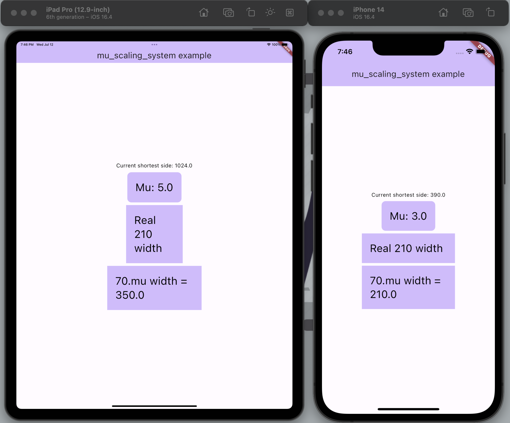

<div align="center">
  
  <br />
  <h1>Mu Scaling System</h1>
  <h3>Make your design adaptive for all screens using Mu system</h3>
</div>



### How it works?

When developing applications for different screens, the following problem arises: widgets and text are difficult to adapt to different extensions. For example, if you are developing an application based on the "Iphone 14 Mini", on the "Iphone 14 Pro Max" it will seem small and hard to use. And on tablets it looks disgusting...

This library solves the problem as follows.
Depending on the screen data, you specify a common unit of measurement - Mu. Depending on the screen magnification, you increase the Mu. As a result, almost all widget size actions should be based on Mu.
In total, the specified number of Mu on tablets will be larger, which is why the entire interface will be larger, but since everything depends on Mu, it will be proportional.

### How to use it?

1. Wrap your MaterialApp in MuScalingBuilder.
2. Pass a arguments in MuScalingBuilder:
* conditions - list of conditions for Mu.
* defaultValue - value of Mu if all conditions do not fit.

        The conditions work like this:
        Mu is calculated by going through each condition sequentially in the list.
        If Mu finds a condition, it takes a value from it.
        If all the conditions do not fit, Mu is set to defaultValue.

Example:
```dart
MuScalingBuilder(
    conditions: [
    MuCondition.side(
        mu: 4,
        minShortestSide: 400,
        maxShortestSide: 800,
    ),
    MuCondition.side(
        mu: 5,
        minShortestSide: 800,
        maxShortestSide: 1500,
    ),
  ],
  defaultValue: 4,
  child: const MyApp(),
),
```

3. Use Mu for widgets with num extension:
```dart
SizedBox(
    height: 8.mu,
),
```

4. Use Mu for TextStyle or TextTheme with extensions:
```dart
TextStyle(fontSize: 14).scale((fontSize, mu) => fontSize * mu / 3.5);
TextTheme().scale((fontSize, mu) => fontSize * mu / 3.5);
```
Important points:
* The function for adapting the size of the text style is not general, you can do your own. It exists in order to adjust the size of the text to Mu, but not to make the text out of size.
* .scale() cannot be used if TextStyle does not have font Size set. (If you want to use out of the box, I recommend the Typography class).

5. Enjoy!


### Contributing 
Contributions are welcomed!
Here is a curated list of how you can help:
* Report bugs and scenarios that are difficult to implement
* Report parts of the documentation that are unclear
* Fix typos/grammar mistakes
* Update the documentation / add examples
* Implement new features by making a pull-request
